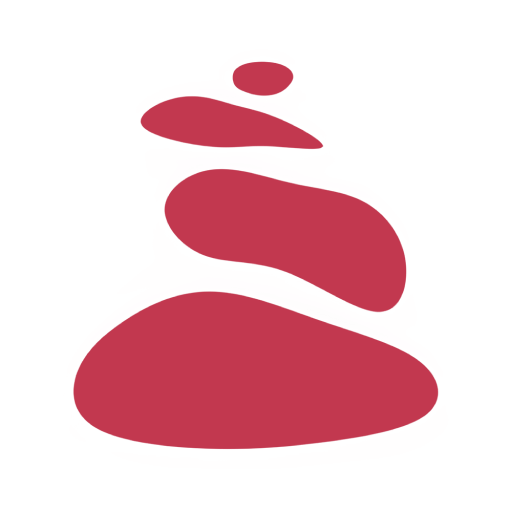
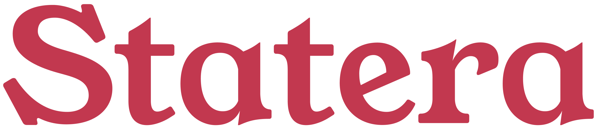

# Statera 🥘: An app made for building meal plans

## 

## **About the app** 💬

### **Statera means _balance_ or _equilibrium_ in latin.** 🌐

Statera is a web app whose objective is to help diversifying the meal habits of the average person by suggesting new local recipes made with the same groceries they buy usually, without a need to search for exotic ingredients or switching to a wider budget.

Users are able to tell Statera their cooking schedule and preferred ingredients, and they're able to upload recipes as well, if they wish to share new cooking perspectives or to build a community by doing so. To keep track of liked recipes, the user has a recipe book where they can save their preferred recipes and ingredients in a way such they are offered again on a later ocassion.

This app is currently being developed under Golang for its backend along with a simplish frontend written in ReactJS. The project has been thought, designed and written for Ingeniería de Software II, an UNAL subject for the 2022-I semester.

---

## **Screenshots** 📷

_These are pending for now._
